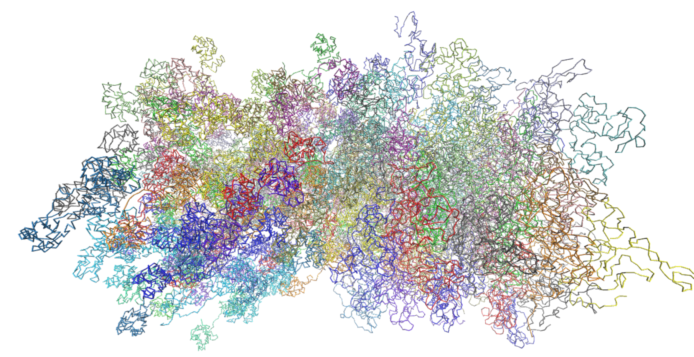

# TCL Generator for calvados files
This is a simple python script to generate a TCL script which can be loaded in VMD to visualise the bonds in a calvados simulation.
It can be executed via 
python TCL_Generator_Calvados.py -i [patht/[protein_name].[xml/txt/pdb]] -o [output_path/file.tcl]
UPDATE: both arguments are now optional. The default will search the folder for an xml file and write the output into bonds.tcl.

### Known Issues:
Input files:
- bond_[proteinname].txt files are currently barely tested because of missing example files
- pdb files will only bind atoms i with i+1 with resid i (works only for linear molecules)
- xml files are currently best tested

Ordered regions:
- The calvados way of handling ordered proteins using harmonic bonds can mess up things. This is currently solved by exkluding all bonds with k=700. Adjust if needed.

### Future ideas:
- parse whole folder and autosearch for suitable files.

### Notes from the author
This code was written in the context of my teaching assignment for a course about calvados simulations by Prof. Lukas Stelzl. I have not much experience with calvados, but i hope people enjoy this code.
Jonas
